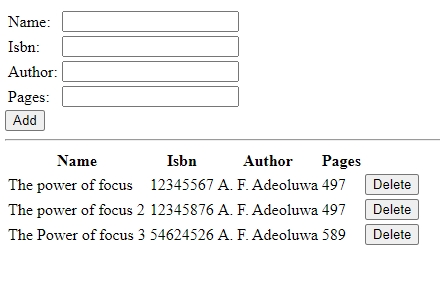

# Project_4 Documentation

### After logging into my instance, i updated and upgraded the machine

`sudo apt update`

`sudo apt upgrade`

### I went ahead to add certificates

`sudo apt -y install curl dirmngr apt-transport-https lsb-release ca-certificates`

### Installing node js

`sudo apt install -y nodejs`

### I went ahead to install mongodb

`sudo apt-key adv --keyserver hkp://keyserver.ubuntu.com:80 --recv 0C49F3730359A14518585931BC711F9BA15703C6`

`echo "deb [ arch=amd64 ] https://repo.mongodb.org/apt/ubuntu trusty/mongodb-org/3.4 multiverse" | sudo tee /etc/apt/sources.list.d/mongodb-org-3.4.list`

`sudo apt install -y mongodb`

### I started the server and checked to make sure its running

`sudo service mongodb start`

`sudo systemctl status mongodb`

### I installed npm (node package manager)

`sudo apt install -y npm`

### Installing body parser to help process json files

`sudo npm install body-parser`

### Went ahead to install express mongoose

`sudo npm install express mongoose`

### starting the server

`node server.js`

### I opened TCP port 3300 and the used the public IP to access the app on my browser

